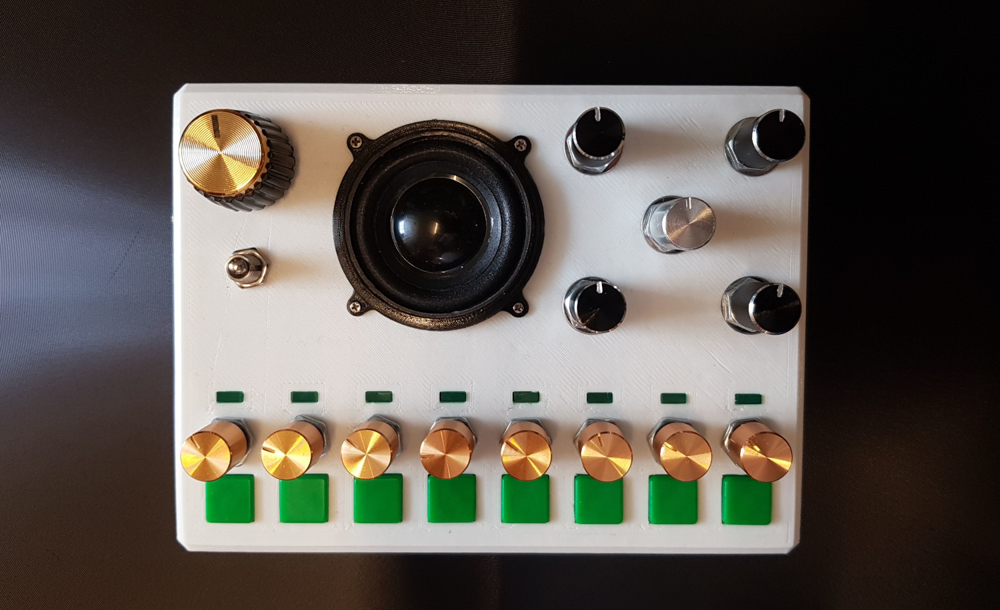
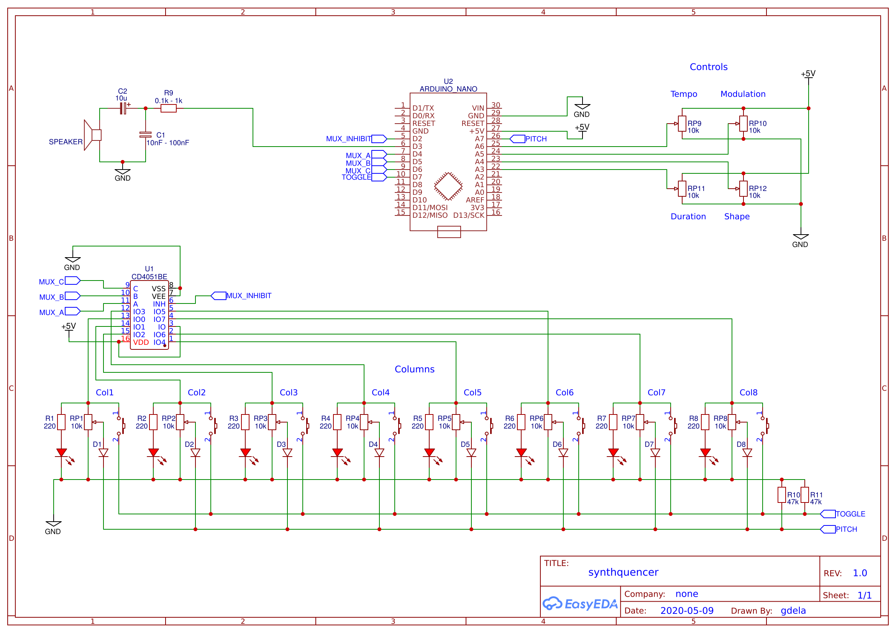
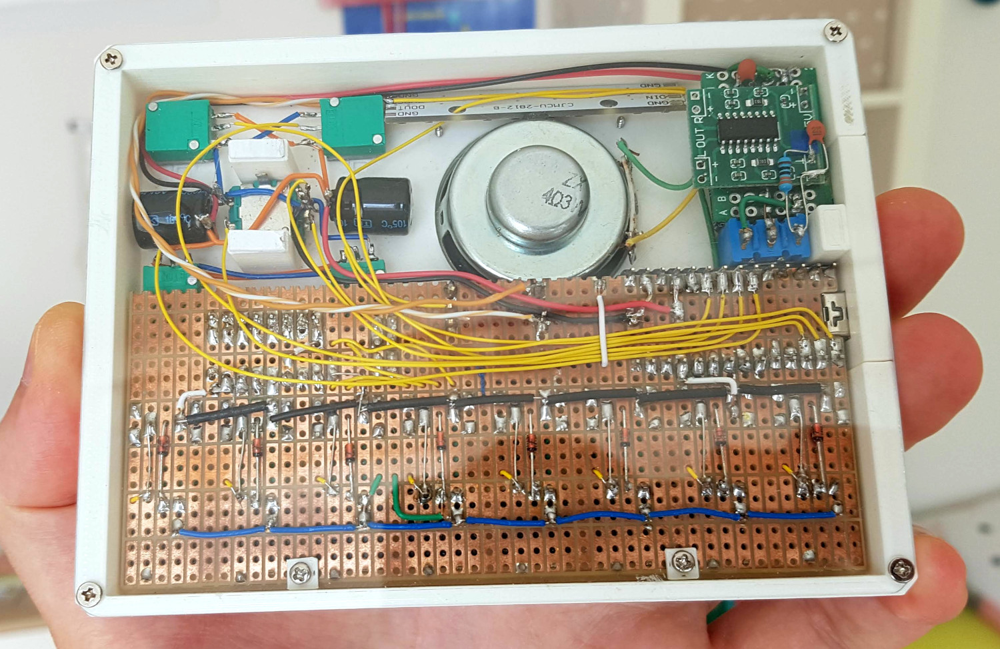

The SynthQuencer
================

The SynthQuencer is a toy I made - an Arduino based synthesiser/sequencer toy.
Here you can find the source code and schematics, see the toy [being made
and played on youtube](https://youtu.be/efjXk1XvBzs).

    

    
    

